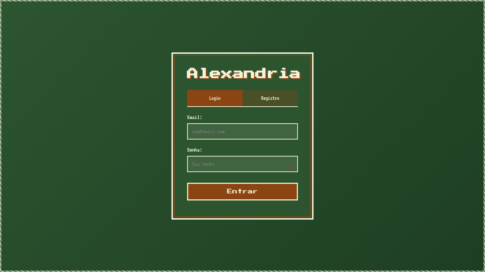
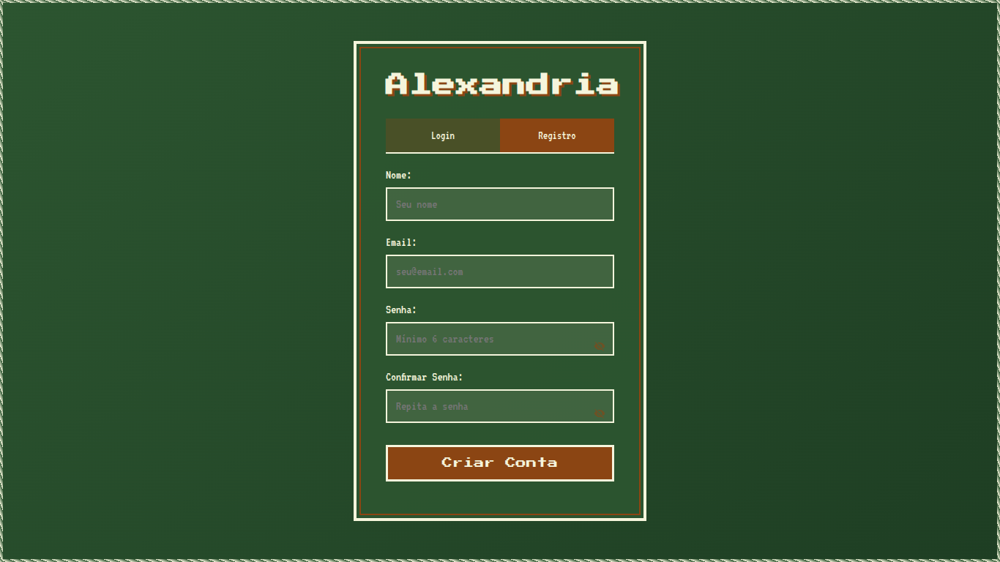
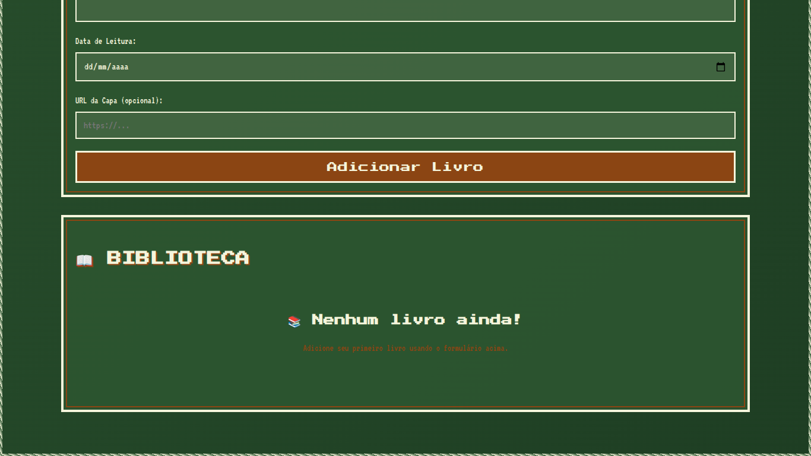

# Identidade Visual do Projeto Alexandria

## Origem do Nome
O nome da aplicação remete à **cidade de Alexandria**, um dos grandes centros culturais e acadêmicos da antiguidade, reconhecida pela sua célebre **Biblioteca de Alexandria**, que armazenava vasto conhecimento. Esse nome foi escolhido para reforçar a ideia de um espaço de saber, organização e sofisticação.

---

## Paleta de Cores
A identidade visual se apoia em uma paleta que transmite sofisticação, naturalidade e equilíbrio, com base em três cores principais:

### Verde Escuro
- **Significados**: natureza, equilíbrio, saúde, bem-estar, esperança.
- **Valores agregados**: dinheiro, sucesso, renovação.
- **Sensações transmitidas**: tranquilidade, frescor e segurança.
- **Tom escuro**: sofisticação, estabilidade, seriedade e elegância.

### Marrom
- **Significados**: segurança, estabilidade, conforto e naturalidade.
- **Associações**: terra, madeira e elementos rústicos.
- **Papel na paleta**: reforça o vínculo com a natureza e a ideia de robustez.

### Creme
- **Significados**: neutralidade, calor, conforto, modéstia e pureza.
- **Sensações transmitidas**: suavidade, tranquilidade e simplicidade.
- **Uso**: base versátil que transmite confiança, sofisticação e elegância.

### Síntese Visual
A combinação de **verde, marrom e creme** evoca a estética de **estantes de livros** e de **ambientes luxuosos da década de 1930**, criando um equilíbrio entre o **vintage** e o **moderno**.

---

## Tipografia
A fonte escolhida para o projeto é a **Press Start 2P**, que reforça o contraste entre o clássico e o contemporâneo. Sua estética pixelada agrega um tom moderno e tecnológico à identidade visual, contrapondo-se à atmosfera vintage sugerida pela paleta de cores.

---

## Valores do Sistema
O sistema deve comunicar os seguintes valores:
- **Sofisticação**: refletida na escolha de tons escuros e elegantes.
- **Praticidade**: garantida pelo contraste visual e pela clareza da tipografia.
- **Eficiência**: representada pela estrutura organizada e legível.
- **Conforto e Confiança**: transmitidos pela combinação de cores neutras e naturais.

A identidade visual foi planejada para **reforçar esses valores**, criando um sistema que transmite tanto **credibilidade e estabilidade**, quanto **modernidade e acessibilidade**.

---

## Esboço da Estrutura Inicial
Abaixo estão os esboços em baixa fidelidade da interface do sistema:

### Tela de Login

### Tela de Registro

### Metas Anuais

### Biblioteca

### Progresso Mensal

### Adicionar Livro
